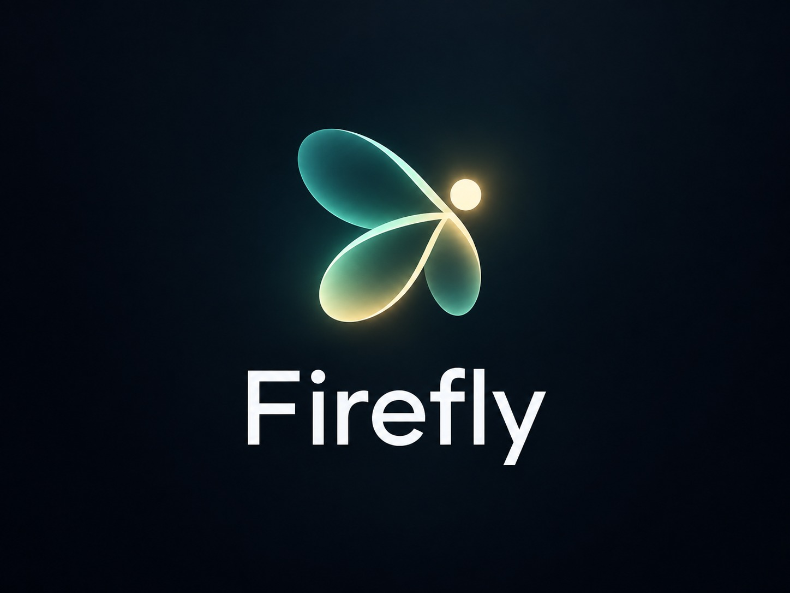
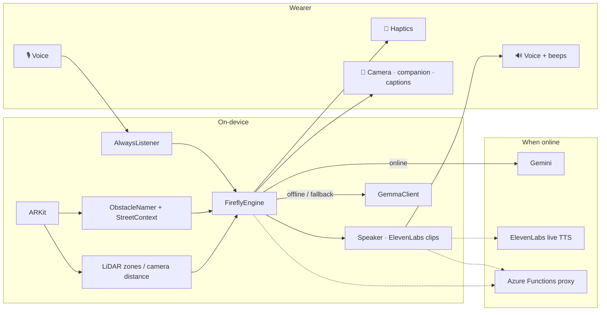

<div align="center">



# Firefly

### A chest-worn iPhone guide for blind and low-vision walkers

*Firefly watches the next few steps, names what's in the way, and tells you through a calm voice, haptics, and a glowing companion on screen — even with Wi‑Fi off.*

<p>
  
  
  
  
  
  
  
  
  
  
</p>

<sub>🔥 Built at <b>GirlHacks 2026</b> · NJIT Campus Center · Oct 3–4, 2026</sub>

</div>

---

## 🧬 Overview

Firefly is a voice-first guide worn on a chest lanyard. Say **"Firefly, …"** and it answers. Between questions, it watches the path so you don't walk into what's ahead.

> The phone handles danger locally. AI helps Firefly understand the world — it never owns the safety loop.

1. **Watches** left / ahead / right — LiDAR when available, camera distance when not.
2. **Feels** — taps speed up as something gets closer; a soft heartbeat means the path is clear.
3. **Names** obstacles on-device; Gemini (online) or Gemma (offline) fill in the gaps.
4. **Speaks** short, calm ElevenLabs lines — never yelling alerts.
5. **Answers** about the view, including cars, buildings, and crossing lights if you need to get somewhere nearby in an emergency. Not turn-by-turn navigation.

Firefly doesn't replace a cane or a guide dog. It adds another sense to a phone people already carry.

---

## ✨ Highlights

| | |
|---|---|
| 🛡️ **Offline safety** | Depth, haptics, beeps, and spoken callouts run on the phone. No network needed to say *"Stop."* |
| 📱 **Any iPhone** | LiDAR Pro preferred. Without it, a vision model estimates distance from the camera. |
| 🧠 **Gemini + Gemma** | Gemini when you're online; on-device Gemma-style answers when you're not. |
| 🗣️ **Calm ElevenLabs voice** | ~130 bundled clips play instantly offline. Live TTS only when needed. |
| 🚦 **Street awareness** | Ask about cars, storefronts, pedestrian lights — info you can act on, not a route. |
| 👂 **Always listening** | Wake word *"Firefly…"* — interrupt anytime while it's talking. |
| 🤫 **Quiet mode** | Haptics only. |
| 🔥 **Glowing companion** | A firefly on screen that drifts toward the nearest obstacle. |

---

## 🏗️ Architecture



**Safety never waits on the network.** Depth decides *where*; Vision / Gemini / Gemma decide *what*.

---

## 🎙️ Voice commands

Always start with **"Firefly, …"**

| Say | Firefly does |
|---|---|
| `Firefly` | *"I'm here. Ask me what's in front of you."* |
| `… what's in front of me?` | Describes the camera view |
| `… are there any cars?` / crossing light | Street-context answers |
| `… quiet on` / `quiet off` | Haptics-only or speak again |
| `… help` / `emergency` | Calm safety guidance |
| `… stop` / `cancel` | Stops talking |
| `… close` | Closes the app |

---

## 🚀 Quick start

```bash
git clone https://github.com/farhanmir/FireFly.git
cd FireFly
chmod +x scripts/mac-bootstrap.sh
./scripts/mac-bootstrap.sh
```

1. Fill `Firefly/Secrets.swift` (Gemini + ElevenLabs at minimum).
2. Xcode → Signing → Team → run on a **physical iPhone**.
3. Allow Camera, Mic, Speech. Say **“Firefly, what's in front of me?”**

Optional phrase bank:

```bash
ELEVENLABS_API_KEY=... ELEVENLABS_VOICE_ID=... python3 scripts/generate_phrases.py
```

More detail: [`SETUP.md`](SETUP.md) · Devpost paste: [`DEVPOST.md`](DEVPOST.md)

---

## 📦 Repo map

| Piece | Role |
|---|---|
| `FireflyEngine.swift` | Safety loop, voice, scene Q&A |
| `DepthZoneAnalyzer.swift` | LiDAR left / center / right |
| `MonocularDistanceEstimator.swift` | Camera-only distance (no LiDAR) |
| `ObstacleNamer.swift` | On-device object names |
| `StreetContextAnalyzer.swift` | Cars, buildings, crossing-light color |
| `SceneAI.swift` | Gemini when online → Gemma offline |
| `GemmaClient.swift` | On-device scene answers |
| `GeminiClient.swift` | Cloud vision Q&A |
| `Speaker.swift` | ElevenLabs + bundled calm clips |
| `EnvironmentMemory.swift` | Future place-learning (disabled) |
| `Firefly/Phrases/` | ~130 offline ElevenLabs clips |
| `azure-function/` | Optional key proxy |

---

## 🧱 Built with

ARKit · Core Haptics · Apple Vision · Apple Speech · ElevenLabs · Google Gemini · Gemma (on-device backup) · SwiftUI · Azure Functions (optional)

---

## 👥 Team · GirlHacks 2026

| Name | Links |
|---|---|
| **Farhan Mir** | [GitHub](https://github.com/farhanmir) · [LinkedIn](https://www.linkedin.com/in/farhan-mir) |
| **Aryan Singh** | [GitHub](https://github.com/AryanSingh103) · [LinkedIn](https://www.linkedin.com/in/aryansingh123/) |
| **Krish Maske** | [GitHub](https://github.com/KrishMaske) · [LinkedIn](https://www.linkedin.com/in/krishmaske/) |

---

<div align="center">

**Firefly: a tiny point of light that helps you through the dark.**

<sub>Not a replacement for a cane or guide dog — a 24-hour prototype that adds another sense.</sub>

</div>
